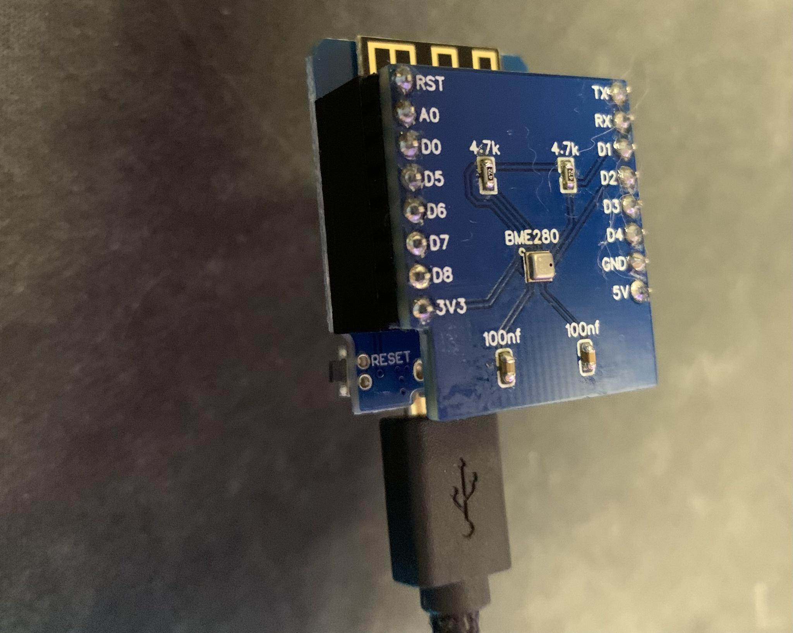
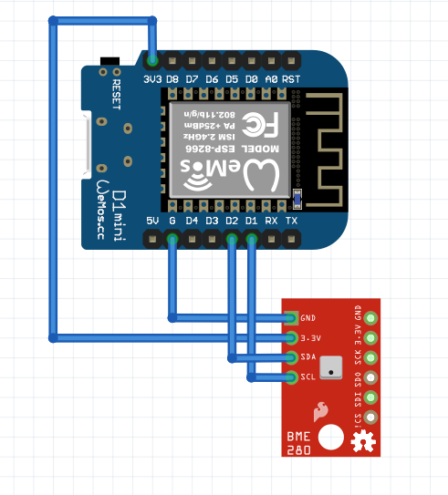
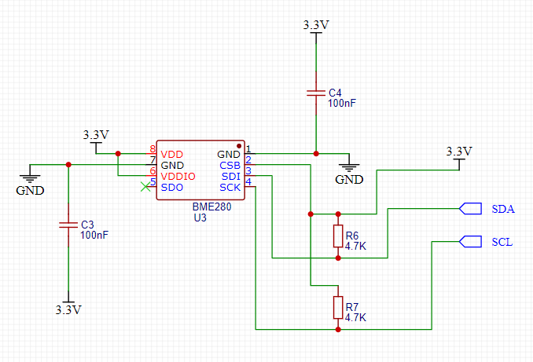
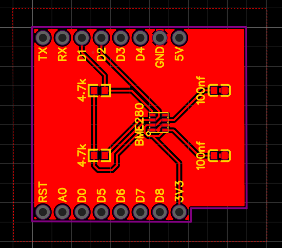
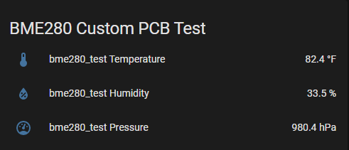

## Wemos D1 Mini BME280 Hat

Simple Hat to measure temperature, humidity, and pressure from a BME280 component.

## License

 This work is licensed under a <a rel="license" href="http://creativecommons.org/licenses/by-sa/4.0/">Creative Commons Attribution-ShareAlike 4.0 International License</a>.

## Parts needed

- 1 x Wemos D1 Mini
- 1 x BME280 component
- 2 x 4.7kΩ resistor
- 2 x 100nf capacitors

You can pick all the items (except the Wemos D1 Mini board) up via this Octopart BOM: [https://octopart.com/bom-tool/DlyBUFxp](https://octopart.com/bom-tool/DlyBUFxp). You can get the Wemos D1 Mini on [Amazon](https://smile.amazon.com/HiLetgo-Development-ESP8285-Wireless-Internet/dp/B07BK435ZW) or cheaper (but longer delivery time) [AliExpress](https://www.aliexpress.com/item/32659152063.html)

## Description

I often used "off the shelf" BME280 sensors with my ESP8266 boards to monitor temperature and humidity of various rooms in my house. However, having tiny breadboards and random wires hanging off was less than desirable. I figured this would be an easy board to prototype and make a stacking header. 

Unlike the Adafruit Huzzah ESP8266 that I had used previously, this component does not support a LiPo battery, however it's much smaller. I use this for scenarios where I know I won't lose power, or if I do, it's not important. Additionally, the Wemos D1 Mini provides WiFi capability to add it to my home network with HomeAssistant/ESPHome.

*Do note, that the BME280 component is an LGA package, which means to solder it, you will need a reflow oven or hot air station.*

While designing this circuit, I referred to the [Wemos D1 Mini pinout](https://docs.wemos.cc/en/latest/d1/d1_mini.html) document often. 

I imagine this will also work with the Wemos ESP32 version, but I haven't tested it.
 
## Schematic

I originally had this on a breadboard, with an "off the shelf" BME280 board connected to the ESP8266, which was less easy to play with. It essentially looked like this ([Fritzing file](Wemos_D1_Mini_BME280_Sensor.fzz)):

To make it easier, to assemble and to look more professional when I shared it with others, I decided to use a custom PCB that anyone could order. Being a fairly new PCB designer, I used EasyEDA to design my circuit.

## PCB

I've included the [Gerber files](wemos_d1_bme280_hat_gerber.zip) if you want to order your own PCB from [JLCPCB](https://jlcpcb.com/) or somewhere else.

## HomeAssistant Example

I've included an [example](esphome.yaml) of how I setup the Wemos D1 Mini ESP8266

## 3D Printed Case

TODO: Make a custom case based on this amazing Adafruit case: https://www.thingiverse.com/thing:2209964
